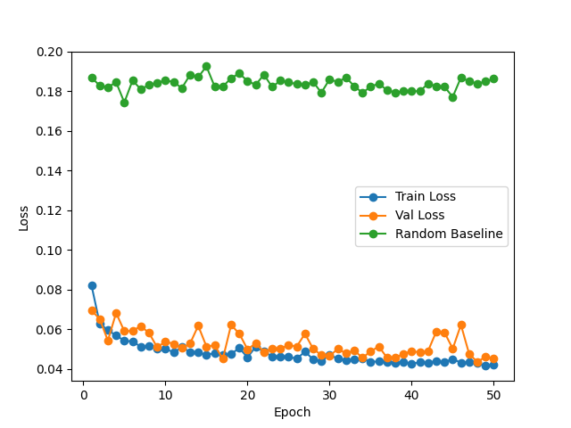

# LiDAR Data Vehicle Trajectory Prediction

This repository is a project to predict vehicle trajectories using sequential LiDAR point clouds from a sample of the KITTI Odometry dataset. It demonstrates end‑to‑end data loading, balancing, augmentation, modeling, and training utilities in PyTorch.

It uses a PointNet encoder to extract features from point clouds, followed by an LSTM to predict future trajectories. The model is trained using a combination of distance and direction loss functions.
The training process is visualized live using Matplotlib, and checkpoints are saved automatically.

Video on the test dataset (never seen during training) showing the predicted trajectory overlaid on the ground truth trajectory:

[Watch the full demo on YouTube](https://www.youtube.com/watch?v=TXlQMv4obH8)

I had to balance the dataset as the original data is heavily imbalanced, with most sequences having the vehicle moving straight. I implemented a custom dataset class to sample sequences with a balanced distribution of turns and straight paths (>3 absolute degrees over x axis).

For training I sample the 1e5 points per frame to around 30k points, which is a good trade-off between performance and speed. I also added a small amount of noise to the point clouds to augment the dataset.

## Project Highlights

## Mathematical Background

### Translation Computation

To extract the 3D translation between two consecutive LiDAR frames:

1. **World poses** are loaded as 4×4 homogeneous matrices `pose_i` and `pose_j` (from `load_poses`), each containing rotation `R` and translation `t`:
   ```
   pose = [[R | t],
           [0 0 0 1]]
   ```
2. **Relative transform** is computed by inverting the first pose and multiplying by the second:
   ```python
   rel = torch.inverse(pose_i) @ pose_j
   ```
3. **Translation vector** is the first three elements of the last column of `rel`:
   ```python
   t_rel = rel[:3, 3]  # shape (3,)
   ```

This vector `t_rel` is stored in `self.translations` and used as the training target.

### Model Architecture

1. **PointNetEncoder**
   - Input: batch of point clouds `[B, N, 3]`.
   - Applies shared MLP (`Conv1d(3→64→128→feat_dim) + ReLU`)
   - Global max-pooling → outputs features `[B, feat_dim]`.
2. **Temporal LSTM**
   - Input: sequence of encoded frames `[B, T, feat_dim]`.
   - Two-layer LSTM with hidden size `hidden_dim` → outputs sequence `[B, T, hidden_dim]`.
   - Final hidden state at time step T → `[B, hidden_dim]`.
3. **Decoder MLP**
   - Two fully-connected layers (`hidden_dim→hidden_dim→out_dim`) with ReLU.
   - Output: predicted translation vector `[B, 3]`, corresponding to `(t_x, t_y, t_z)`.

This pipeline transforms raw LiDAR scans into accurate short‑term trajectory estimates.

- **End-to-end Pipeline**: From raw KITTI scans to trajectory prediction.
- **Modular Design**: Clean separation of dataset, model, loss, and training code.
- **Interactive Visualization**: Live loss curves (train / val / random baseline) via Matplotlib.
- **Checkpoint Management**: Automatically saves the latest and keeps top‑3 best by validation loss.

## Repository Layout
```
├── data/                  # Utility modules and configs
│   ├── config.py          # Hyperparameter and path configs
│   └── plotstate.py       # Dataclass for live metric plotting
├── datasets/              # Data-loading pipelines
│   ├── SemanticKITTIDataset.py # Main dataset class for loading LiDAR data
│   ├── PointSamplerDataset.py # Subsampling point clouds
│   ├── SequenceDataset.py # Stacking point clouds into sequences
│   ├── BalancedSequenceDataset.py # Balancing dataset for turns and straight paths
│   └── utils.py           # Helper functions for parsing calibration/poses
├── losses/                # Loss function modules
│   ├── distance_loss.py
│   ├── direction_loss.py
│   └── combined_loss.py
├── models/                # Model definitions
│   ├── PointNetEncoder.py
│   └── TrajectoryPredictor.py
├── plotting/              # Visualization & checkpoint management
│   └── CheckpointManager.py
├── train_modules/         # Training and validation loops
│   ├── train_loop.py
│   ├── val_loop.py
│   └── utils.py           # Device selection and helpers
├── SemanticKITTI_00/      # KITTI odometry data
│   ├── velodyne/          # LiDAR scans (.bin files)
│   ├── calib.txt
│   ├── poses.txt
│   └── times.txt          
├── checkpoints/           # Saved model checkpoints
├── train.py               # Main entrypoint script
├── test.py                # Quick evaluation script
├── traj_anim.gif          # Sample trajectory animation
└── README.md              # Project overview and instructions
```

## Configuration
Edit the `Config` dataclass in `train.py` to adjust hyperparameters or file paths:

```python
data_path: Path = Path("SemanticKITTI_00/")
seq_len: int = 5
n_points: int = 30_000
batch_size: int = 16
num_epochs: int = 50
train_split: float = 0.8
lr: float = 1e-3
weight_decay: float = 1e-5
checkpoint_dir: Path = Path("checkpoints")
angle_threshold: float = 3.0
noise_amount: float = 0.15
```

## Training
Run the main script:
```bash
python -m train
```
This will:
- Load and preprocess data
- Initialize the PointNet‑LSTM model
- Train over the specified epochs
- Live‑plot losses and save checkpoints
- Save the best model based on validation loss

## Testing
To evaluate the model, run:
```bash
python test.py
```
This will:
- Load the best checkpoint
- Predict trajectories on the test set
- Save the predictions in a video as `traj_anim.mp4`


## Checkpoints
- **latest.pt**: Overwritten each epoch
- **Top‑3 best**: Files named `val_{val_loss:.4f}_epoch_{epoch}.pt`, auto‑pruned beyond three

## Customization
- **Data Augmentation**: Adjust noise level in `SemanticKITTIDataset`.
- **Balancing**: Modify `__init__` in `BalancedSequenceDataset` to change sampling strategy.
- **Loss Weights**: Change `(w_dist, w_dir)` in `loss.py`’s `combined_loss`.
- **Model Variants**: Swap encoder or tweak LSTM size in `model.py`.

## Cool Training Curves



## Full Video
[](https://www.youtube.com/watch?v=TXlQMv4obH8)